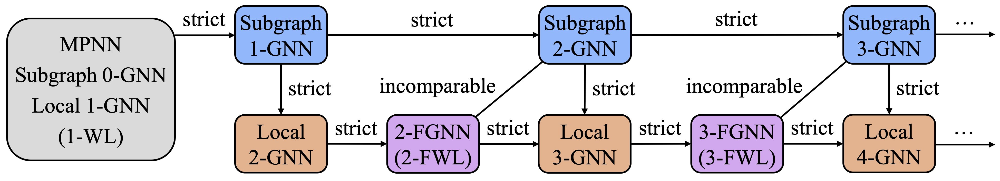

# Homomorphism Expressivity

The official code of the paper **[Beyond Weisfeiler-Lehman: A Quantitative Framework for GNN Expressiveness](https://openreview.net/pdf?id=HSKaGOi7Ar)**.



## Installation

Required packages:
- torch 1.9.0
- torch-scatter 2.0.8
- torch-geometric 1.7.2

## Commands

The dataset for the counting task is generated by running the command `python data/count.py`. The training commands are contained in the bash scripts `main.zinc.sh` (for both ZINC-subset and ZINC-full datasets), `main.alchemy.sh` (for the Alchemy dataset), and `main.count.sh` (for both homomorphism and cycle counting tasks).

## Training Logs

Log files in folders named with the prefix `result` contains training results for different model configurations. In each file, the i-th row contains metrics at the i-th training epoch, which is in the following format:

| Learning rate | Training loss | Validation set MAE | Test set MAE |
|-|-|-|-|

The file names begin with a prefix indicating the model type: `MP` for message-passing NN, `Sub` for subgraph GNN, `L` for local 2-GNN, and `LF` for local 2-FGNN. The `-G` suffix denotes the inclusion of global aggregation in each layer.

### ZINC

The file name follows the format: `f"result.zinc/{model}-{subset}-{max_dis}-{num_layer}x{dim_embed}-{bs}-{lr}-{seed}.txt"`, where each component represents the model string, subset or full dataset, maximum distance encoding, batch size, learning rate, and random seed.

### Alchemy

The file name follows the format: `f"result.alchemy/{model}-{max_dis}-{num_layer}x{dim_embed}-{bs}-{lr}-{seed}.txt"`, where each component represents the model string, maximum distance encoding, batch size, learning rate, and random seed.

### Count

The file name follows the format: `f"result.count/{model}-{task}-{max_dis}-{num_layer}x{dim_embed}-{bs}-{lr}-{seed}.txt"`, where each component represents the model string, task name, maximum distance encoding, batch size, learning rate, and random seed. The task name is a tuple of structure name (see [`dataset.py`](src/dataset.py) for detailed definitions) and counting level (`g` for graph level, `v` for node level, and `e` for edge level).

## Timeline

- 2024.01.14: release code.
- 2024.01.19: update citation.

## Acknowledgement

Our code is based on [SWL](https://github.com/subgraph23/SWL).

## Citation

If you find this repository useful, please cite our work:
```
@article{zhang2024beyond,
  title={Beyond Weisfeiler-Lehman: A Quantitative Framework for GNN Expressiveness},
  author={Zhang, Bohang and Gai, Jingchu and Du, Yiheng and Ye, Qiwei and He, Di and Wang, Liwei},
  journal={arXiv preprint arXiv:2401.08514},
  year={2024}
}
```
